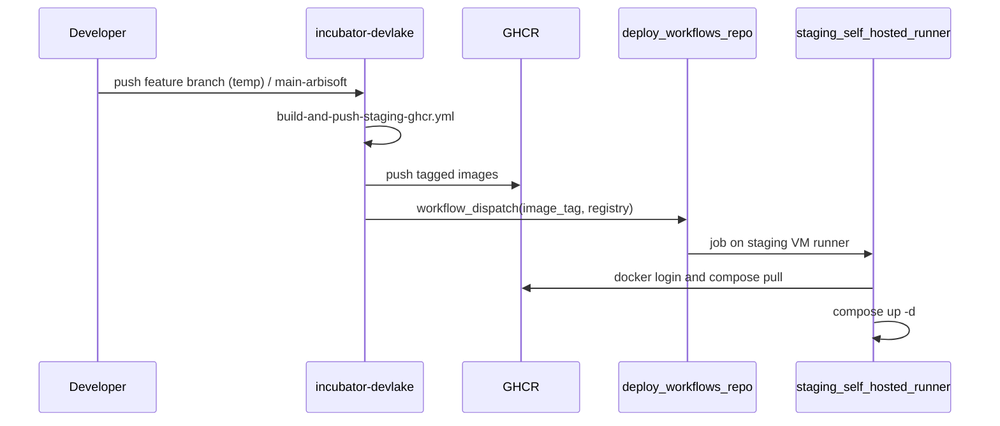
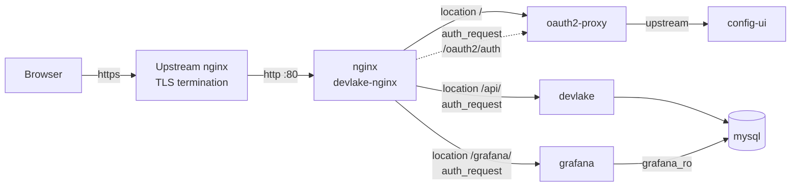

<!--
Licensed to the Apache Software Foundation (ASF) under one or more
contributor license agreements. See the NOTICE file distributed with
this work for additional information regarding copyright ownership.
The ASF licenses this file to You under the Apache License, Version 2.0
(the "License"); you may not use this file except in compliance with
the License. You may obtain a copy of the License at

 http://www.apache.org/licenses/LICENSE-2.0

Unless required by applicable law or agreed to in writing, software
distributed under the License is distributed on an "AS IS" BASIS,
WITHOUT WARRANTIES OR CONDITIONS OF ANY KIND, either express or implied.
See the License for the specific language governing permissions and
limitations under the License.
-->

# DevLake staging deployment

Single-VM Docker Compose deployment for `https://aperture.arbisoft.com`, sized
for **4 vCPU / 8 GB**.

App images are **pulled from GHCR** (built in CI). This host does not build
`devlake` / `config-ui` / `grafana`.

## CI / CD pipeline



| Piece | Location |
| --- | --- |
| Build + push | [`.github/workflows/build-and-push-staging-ghcr.yml`](../../.github/workflows/build-and-push-staging-ghcr.yml) in this repo (push trigger temporarily on `add-staging-docker-compose`; switch to `main-arbisoft` after validation) |
| Deploy | Separate workflows-only repo; runs on a **self-hosted runner on this VM** |
| Compose | This directory (`docker-compose-staging.yml`) |

### Images and tags

| Image | GHCR name |
| --- | --- |
| DevLake API | `ghcr.io/<owner>/devlake:<tag>` |
| Config UI | `ghcr.io/<owner>/devlake-config-ui:<tag>` |
| Grafana dashboards | `ghcr.io/<owner>/devlake-dashboard:<tag>` |
| Build caches | `ghcr.io/<owner>/devlake-ci-cache:amd64-builder` / `:base` |

Tag rules (from the build workflow):

- Ref matches `^v` → use the version tag as-is
- Otherwise → `{ref}_{yyMMdd_HHmm}_{shortsha}` (e.g. `main-arbisoft_260806_1830_abc1234`)

All three app images share the same `<tag>` for a given build.

### Build workflow secrets (this repo)

| Secret | Purpose |
| --- | --- |
| `GH_APP_ID` / `GH_PRIVATE_KEY` | GitHub App token to dispatch the deploy repo |
| `GH_STAGING_DEPLOY_OWNER` | Deploy repo owner |
| `GH_STAGING_DEPLOY_REPO` | Deploy repo name |
| `GH_STAGING_DEPLOY_WORKFLOW_ID` | Workflow file name or numeric id in the deploy repo |

`GITHUB_TOKEN` with `packages: write` is enough to push to GHCR from this repo.

### Deploy-repo contract

The deploy workflow must accept `workflow_dispatch` inputs:

| Input | Required | Meaning |
| --- | --- | --- |
| `image_tag` | yes | Tag produced by the build (not a full image ref) |
| `registry` | no | Default `ghcr.io/<owner>`; build passes `ghcr.io/${{ github.repository_owner }}` |

Expected behaviour on the **self-hosted staging runner**:

1. `docker login ghcr.io` with a token that has `read:packages`
2. Update `/opt/devlake/incubator-devlake/devops/staging/.env`:
   - `DEVLAKE_IMAGE=${registry}/devlake:${image_tag}`
   - `CONFIG_UI_IMAGE=${registry}/devlake-config-ui:${image_tag}`
   - `GRAFANA_IMAGE=${registry}/devlake-dashboard:${image_tag}`
3. Optionally `git pull` the compose tree if compose files change on `main-arbisoft`
4. `docker compose -f docker-compose-staging.yml pull`
5. `docker compose -f docker-compose-staging.yml up -d`
6. Health-check `http://127.0.0.1` via nginx / `devlake` `/ping` as appropriate

See [deploy-workflow.example.yml](deploy-workflow.example.yml) for a copy-paste starter to place in the deploy repo (adjust runner labels and paths).

## Architecture

TLS terminates on an **upstream** nginx outside this stack, which forwards to
port 80 on this VM. Everything else is internal to the `backend` network.



Both `/api/` and `/grafana/` are gated by nginx's `auth_request` against
oauth2-proxy. This matters: DevLake's own API-key middleware only guards paths
under `/rest` and `AUTH_ENABLED` defaults to `false`, so that gate is the only
thing in front of the admin API. Grafana's login form is a second gate behind
the same check.

### The one deliberate exception: `/api/rest/`

`/api/rest/` **skips** the oauth2-proxy gate, because DevLake authenticates
those paths itself and their callers have no browser session. `RestAuthentication`
runs first in the middleware chain (`backend/server/api/api.go:111`) and
short-circuits every `/rest` path through `CheckAuthorizationHeader`, which
validates the Bearer API key, its expiry, and its allowed-path regex.

Gating it would silently break **incoming webhooks** and any CI automation that
uses an API key. If you tighten this, tighten it by issuing narrower API keys,
not by putting a browser-session gate in front of a machine endpoint.

## One-time host setup

Run these **before** the first `docker compose up`.

### 1. Verify the deployment directory

Compose and nginx config live under `devops/staging/`. A full clone is still
useful for `git pull` of compose changes; images themselves come from GHCR.

```text
/opt/devlake/incubator-devlake/          # git clone of this fork
└── devops/staging/                      # compose, nginx.conf, .env, …
```

```bash
ls -ld /opt/devlake/incubator-devlake/devops/staging
ls /opt/devlake/incubator-devlake/devops/staging/docker-compose-staging.yml
```

If the clone is missing:

```bash
sudo mkdir -p /opt/devlake && sudo chown "$USER": /opt/devlake
cd /opt/devlake
git clone <this-fork-url> incubator-devlake
cd incubator-devlake
git checkout main-arbisoft
```

That `sudo mkdir` / `chown` is the only privileged command in this runbook —
everything below (checkout, `.env`, `docker compose`) runs unprivileged.
MySQL's scratch space needs no root either: it is a Docker named volume
(`devlake_staging_mysql_tmp`) mounted at `/tmp`, which Docker creates on the
first `up` with the image's own `1777` permissions.

> ⚠️ `/opt/devlake/` itself may still hold a separate live DevLake deployment
> owned by user `jawad`. Do not overwrite that tree. This stack lives only under
> `incubator-devlake/devops/staging/`.

### 2. Provision the environment file

```bash
cd /opt/devlake/incubator-devlake/devops/staging
cp env.staging.example .env
chmod 600 .env
$EDITOR .env    # fill in every REQUIRED value, including *_IMAGE once known
```

Compose reads `.env` from the directory containing the compose file, so it must
sit beside `docker-compose-staging.yml`. Every required variable is guarded
with `${VAR:?}`, so a missing value aborts with a named error rather than a
half-started stack.

### 3. GHCR login on the staging host / runner

Private packages need a token with `read:packages` (PAT or GitHub App
installation token). The self-hosted deploy job should log in before `compose
pull`:

```bash
echo "$GHCR_TOKEN" | docker login ghcr.io -u USERNAME --password-stdin
```

Confirm Docker can reach GHCR on `:443` from this VM (`docker pull` a small
public image from `ghcr.io` if needed).

### 4. Register the OAuth redirect URI

Add exactly this to the Google OAuth web client's authorised redirect URIs:

```
https://aperture.arbisoft.com/oauth2/callback
```

It is pinned with `--redirect-url` rather than derived from forwarded headers,
because derivation silently produces an `http://` callback (which Google
rejects) whenever `X-Forwarded-Proto` is missing.

### 5. Confirm the upstream nginx behaviour

The upstream must:

- send `X-Forwarded-Proto: https` and a correct `Host`;
- **not** pass through client-supplied `X-Forwarded-User` / `X-Forwarded-Email`.
  DevLake trusts those headers verbatim for its audit identity. This stack
  blanks them at ingress, but the upstream should not be forwarding them either.

### 6. Check disk capacity

The benchmark environment measured ~11 GB of DevLake data across ~510 tables.
With binary logging disabled, budget **at least 40 GB free** on the Docker
volume root. Pulled images also need several GB of local Docker storage.

## Deploy

Automated path: push to the workflow’s configured branch (currently
`add-staging-docker-compose`, later `main-arbisoft`) → GHCR build → deploy-repo
workflow on the self-hosted runner.

Manual / first-time (after `.env` has valid `*_IMAGE` refs and GHCR login):

```bash
cd /opt/devlake/incubator-devlake/devops/staging
docker compose -f docker-compose-staging.yml pull
docker compose -f docker-compose-staging.yml up -d
docker compose -f docker-compose-staging.yml ps
```

Do **not** run `docker compose build` for the app services — there are no
`build:` blocks. `pull` fetches GHCR app images plus third-party bases
(`mysql`, `nginx`, `oauth2-proxy`).

### Migrating from an earlier revision of this stack

> **Read this before the first `up` on a VM that already runs DevLake.** Both
> volumes are now explicitly named, so neither reuses whatever the previous
> revision created. Nothing is deleted — the old volumes are *orphaned* and the
> new stack starts empty. Copy them across first if you need the data.

**Check for the existing deployment first.** The staging host already has a
DevLake stack at `/opt/devlake` (owned by user `jawad`, compose file last
modified Aug 3) while this one deploys from
`/opt/devlake/incubator-devlake/devops/staging`. It publishes port 80, which
this stack's nginx also binds, so the new stack cannot start until the old one
is stopped. Confirm what is running and who owns it before touching anything —
whoever depends on that deployment should agree to the cutover:

```bash
docker compose ls
docker ps --format '{{.Names}}\t{{.Ports}}'
ls -la /opt/devlake
```

**`mysql_data` — this is the one that matters.** It previously had no `name:`,
so Compose derived a project-prefixed name from whichever directory the compose
file was invoked in (`incubator-devlake_mysql_data` when it lived at the repo
root). It is now `devlake_staging_mysql_data`. Starting the new stack against an
empty volume means MySQL initialises a fresh database and every collected
connection, blueprint and pipeline appears to be gone — the old data is still on
disk, just unreferenced.

Find the existing volume and copy it before the first `up`:

```bash
docker volume ls | grep -i mysql

# Stop the old stack first: copying a live MySQL data directory yields a
# corrupt one.
docker compose -f <old-compose-file> down

docker volume create devlake_staging_mysql_data
docker run --rm -v <old-volume-name>:/from -v devlake_staging_mysql_data:/to \
  alpine sh -c 'cd /from && cp -a . /to'
```

Note that `mysql/initdb/01-grafana-ro.sh` only runs on a *fresh* data
directory. If you copy an existing volume across, create the read-only Grafana
account by hand:

```sql
CREATE USER 'grafana_ro'@'%' IDENTIFIED BY '<GRAFANA_DB_PASSWORD>';
GRANT SELECT ON `devlake`.* TO 'grafana_ro'@'%';
```

**`grafana_data`** used to be declared `external: true` and is now a managed
volume named `devlake_staging_grafana_data`. Lower stakes: dashboards and
datasources are provisioned from the image and come back automatically, so only
manually created users, API keys, and starred dashboards are lost.

```bash
docker volume create devlake_staging_grafana_data
docker run --rm -v grafana_data:/from -v devlake_staging_grafana_data:/to \
  alpine sh -c 'cd /from && cp -a . /to'
```

## Verify

Pre-flight, before deploying:

```bash
docker compose -f docker-compose-staging.yml config --quiet
docker run --rm -v "$PWD/nginx.conf:/etc/nginx/nginx.conf:ro" nginx:stable nginx -t
```

After deploying, confirm the auth gates actually hold. `/grafana/` must return a
302 to `/oauth2/start` and `/api/connections` must return 401 — **a 200 from
either means the gate is open**:

```bash
curl -si https://aperture.arbisoft.com/grafana/          | head -n 1  # expect 302
curl -si https://aperture.arbisoft.com/api/connections   | head -n 1  # expect 401
```

Confirm the API-key path is still reachable but still authenticated. It must
return 401 from DevLake itself (body `{"success":false,"message":"token is
missing"}`), **not** a redirect to `/oauth2/start` — a redirect means the
carve-out above broke and webhooks are dead:

```bash
curl -si https://aperture.arbisoft.com/api/rest/plugins | head -n 1
```

Confirm the DevLake API is not reachable directly on the VM:

```bash
curl -s -m 3 http://<vm-ip>:8080/ping   # must fail to connect
```

Confirm the Grafana datasource is using the read-only account, and that the
query governor is live once dashboards have been used:

```bash
docker compose -f docker-compose-staging.yml exec mysql \
  mysql -uroot -p -e "SHOW GRANTS FOR 'grafana_ro'@'%';"

docker compose -f docker-compose-staging.yml exec mysql \
  mysql -uroot -p -e "SHOW GLOBAL STATUS LIKE 'Max_execution_time_set';"
```

A `Max_execution_time_set` that stays at zero while Grafana is actively
querying means the governor is not matching the account name — see the coupled
literal warning in [mysql/devlake.cnf](mysql/devlake.cnf).

## Layout

| File | Purpose |
| --- | --- |
| `docker-compose-staging.yml` | Service definitions (pull-only app images) |
| `nginx.conf` | Edge routing and the `auth_request` gates |
| `allowed-emails.txt` | oauth2-proxy allowlist, one lowercase address per line |
| `mysql/devlake.cnf` | MySQL tuning, sized for a 3 GiB container |
| `mysql/initdb/01-grafana-ro.sh` | Creates the read-only Grafana account |
| `env.staging.example` | Template for `.env` |
| `deploy-workflow.example.yml` | Starter for the deploy-repo workflow |

## Memory budget

MySQL is capped at `mem_limit: 3g` because it shares the VM:

| Component | Budget |
| --- | --- |
| OS + Docker daemon | ~0.7 GB |
| devlake (ETL) | ~2.0 GB |
| grafana | ~0.5 GB |
| config-ui + oauth2-proxy + nginx | ~0.25 GB |
| **mysql** | **~3.0 GB** |

The 1.5 GiB InnoDB buffer pool is a literal, not a formula, and must stay a
multiple of 512M (`chunk_size 128M x instances 4`) or MySQL silently rounds it
up. Rationale for every value is in [mysql/devlake.cnf](mysql/devlake.cnf).

## Health check coverage

Only three services have healthchecks, and the omissions are deliberate: a probe
that can never pass is worse than no probe, because `depends_on:
condition: service_healthy` would block everything behind it forever.

| Service | Probe | Why |
| --- | --- | --- |
| `mysql` | `mysqladmin ping` | Shipped in the image |
| `devlake` | `curl /ping` | `curl` installed at `backend/Dockerfile:123` |
| `grafana` | `wget /api/health` | `grafana/grafana:11.6.2` is Alpine, so busybox `wget` exists |
| `config-ui` | none | Built on `nginxinc/nginx-unprivileged`, installs only `apache2-utils` and `iproute2` — no HTTP client |
| `oauth2-proxy` | none | v7 images are distroless: no shell, no HTTP client |
| `nginx` | none | No `curl`/`wget`, and no `service` command |

The three uncovered services are all reachable through nginx, so monitor them
from the upstream nginx or an external prober — which is also the only vantage
point that sees the whole request path. If you confirm a client binary exists in
one of those images, add the probe and tighten the corresponding `depends_on`
back to `service_healthy`.

## Known gaps

Deliberate, and tracked rather than fixed here:

- **No backups.** With `--skip-log-bin` there is no point-in-time recovery, so
  a nightly `mysqldump` plus a *tested* restore is the entire recovery story.
- **No resource limits on `devlake`.** A large collection run can consume
  several GB; with no cap the kernel picks the OOM victim, often MySQL.
- **`AUTH_ENABLED=false`.** nginx's `auth_request` is the sole control in front
  of the DevLake API. Enabling DevLake's own OIDC support would make it
  defence-in-depth and give real per-user identity.
- **MySQL spill is isolated, not bounded by a separate filesystem.** The
  `devlake_staging_mysql_tmp` volume keeps scratch writes out of the container
  writable layer and makes them measurable (`docker system df -v`), but it
  lives under `/var/lib/docker/volumes` — on a single-disk VM there is no hard
  disk-full guarantee. The real bounds are the settings in
  [mysql/devlake.cnf](mysql/devlake.cnf) (`temptable_max_mmap = 0`, the 4G cap
  on `innodb_temp_data_file_path`, and the 30s `init_connect` governor on the
  Grafana account). If those prove insufficient, point the volume at a
  dedicated disk with `driver_opts` — no service definition changes.
- **Docker bridge egress.** Historically this VM could not reach Debian mirrors
  from bridge-network containers. That no longer blocks staging deploys (images
  are built on GitHub-hosted runners), but any future on-box `docker build` may
  still need host-network or a fixed `ip_forward` / iptables / UFW setup.
